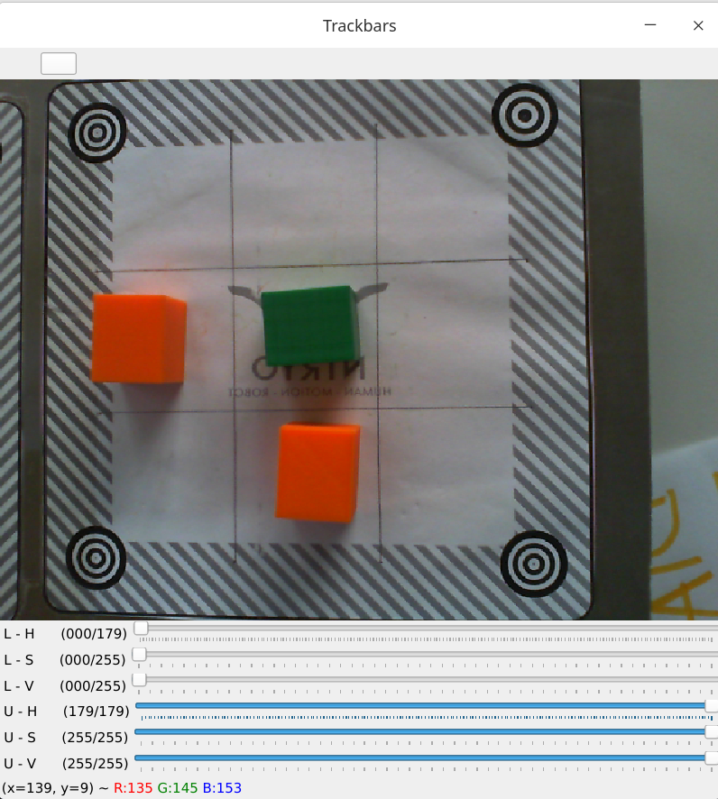

# Tris

In questo progetto abbiamo realizzato un codice che permettesse al Robot Niryo One di giocare a tris. 

_Per questo progetto consigliamo di utilizzare la versione di `pyniryo` `1.1.1`_.

### Hardware

Per questo progetto abbiamo realizzato una piastra di alluminio su cui abbiamo fissato il Niryo e su cui abbiamo incollato tre _workspace_, in modo da evitare di dover effettuare la calibrazione ogni volta.

- Il primo workspace (nel codice chiamato _workspace_dritto_) è il campo da gioco che è stato diviso in 9 parti.
- Il secondo workspace (nel codice chiamato _workspace_destra_) è il luogo dove sono presenti i blocchetti del Niryo.
- Il terzo workspace (nel codice chiamato _workspace_centro_) è il luogo dove sono presenti i blocchetti del giocatore umano.

I pezzi con cui si gioca al nostro tris sono dei cubetti di colore verde o arancione (colori settati in HSV all'interno del codice main.py, nella variabile _boundaries_). È possibile, nonostante i colori siano i medesimi, che la telecamera non veda i blocchetti, poiché ci può essere una luce differente.
Consigliamo quindi, prima di avviare il codice principale, di eseguire _color_calibration.py_ (presente nella cartella colorCalibration) in modo da determinare il range minimo e massimo che volete sia rilevato per un determinato colore.

Abbiamo inoltre montato un pulsante che si deve premere per _"passare il turno al robot"_ durante il gioco.
//foto
Lo schema elettrico è il seguente:

Nel caso si utilizzasse la versione del main `m` allora anziché un semplice pulsante saranno presenti due microbit: 
- il primo ovvero il `sender` che una volta premuto il pulsante invia un segnale all'altro microbit
- il secondo ovvero il `receiver` che sarà collegato al Niryo e sarà in ascolto del segnale
Di seguito sono riportate alcune foto e lo schema elettrico. Inoltre nella cartella `codice_microbit` sono presenti il codice in python e la versione già eseguibile.

**SCHEMA ELETTTRICO**

 
---

### Funzionamento

Il funzionamento del codice è il seguente:
1. Il robot chiede all'utente il colore dei blocchetti che vuole utilizzare
2. Il robot chiede all'utente chi inizierà a giocare
3. Il robot effettua la sua mossa o aspetta che l'utente faccia la sua, fino a quando non vinca uno dei due oppure si pareggi

Per effettuare una mossa i passaggi che fa il robot sono i seguenti:
- Si mette nella posizione di osservazione del workspace di gioco (nel codice chiamata _obs_pose_workspace_dritto_), scatta una foto e ricava i blocchetti presenti e la loro posizione
- Successivamente chiama una funzione di _easyAI_ (ovvero il suo cervello del tris) che ritorna la prossima mossa che il robot deve effettuare
- Dalla mossa si ricava il punto del campo in cui deve posizionare il blocchetto
- Si mette nella posizione di osservazione del workspace di destra (nel codice chiamata _obs_pose_workspace_destra_), scatta una foto e ottiene le coordinate di un blocchetto qualsiasi
- Effettua la mossa per prendere il blocchetto
- Ritorna nella posizione di osservazione del workspace di gioco (nel codice chiamata _obs_pose_workspace_dritto_)
- Effettua la mossa per lasciare il blocchetto nel punto precedentemente ricavato
- Ritorna al primo punto in attesa che venga premuto il pulsante dal giocatore umano

In questo codice sono implementati dei controlli per evitare che l'utente bari togliendo dei blocchetti, aggiungendone più di uno o scambiandone alcuni.

Di seguito è presente un video dimostrativo:
//inserire il video

---

### Versioni
Di questo programma sono presenti numerose versioni del `main` principale:

| Nome del file | Descrizione     | 
| :-------- | :------- |
| `main.py` | È il main principale dove è presente il controllo nel caso si stia barando |
| `main_r.py` | È il main che controlla che l'utente non bari e in caso contrario rimette i blocchetti per ritornare allo stato precedente alla "mano scorretta" |
| `main_v.py` | È il main principale dove è presente il controllo nel caso si stia barando. A differenza delle altre versioni è presente la `vacuum pump` anziché la `pinza`|
| `main_r_m.py` | È analogo al `main_r`, ma anziché il pulsante collegato elettricamente sono presenti due `microbit` che comunicano via radio. |

---

### Autori
- [@GabrieleFerrero](https://github.com/GabrieleFerrero)
- [@VittoriaDutto](https://github.com/vikydutto)
- [@AnthonyRuggero](https://github.com/AnthonyRuggero)
- [@IsabellaBianco](https://github.com/IsabellaBianco)
- [@AndreaBosticardo](https://github.com/Bosticardo-Andrea)
